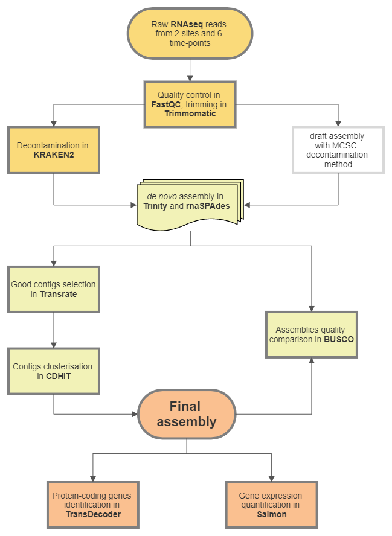
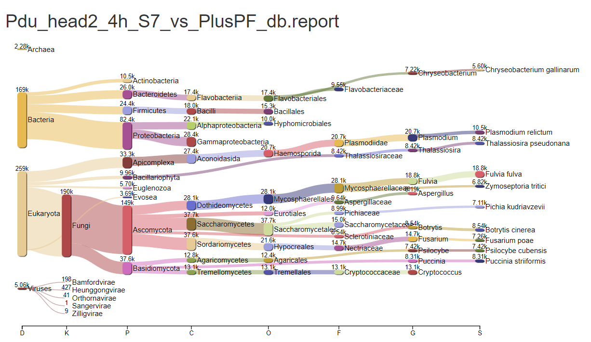
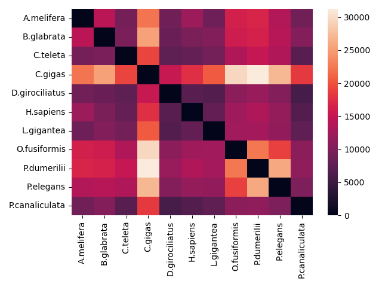
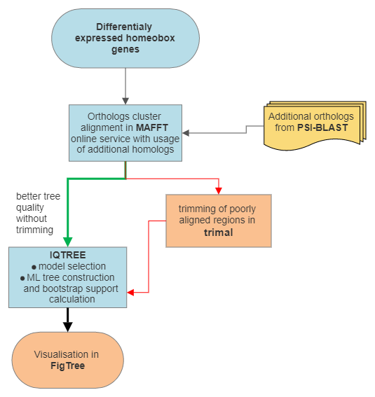

# Analysis of developmental gene expression dynamics during anterior and posterior regeneration of Platynereis dumerilii (Nereididae, Annelida) and Pygospio elegans (Spionidae, Annelida).

Authors: 

- Elena Novikova, The Zoological Institute of Russian Academy of Science (supervisor)
- Maksim Nesterenko, All-Russia Research Institute for Agricultural Microbiology (supervisor)
- Sergei Fomenko (S)
- Dudkovskaia Anastasiia (A)

We analysed gene expression changes during regeneration of two Annelida, Pygospio elegans, capable of anterior and posterior regeneration, and Platynereis dumerilii, capable of only posterior regeneration. Given the homeobox genes play a key role in the anteroposterior axis patterning and organs morphogenesis, we aimed to study the expression pattern of this superfamily of transcription factors during anterior and posterior regeneration.

## Aim, tasks and data
Samples of P.elegans and P.dumerilii were collected for bulk RNA sequencing during anterior (data marked as 'tail') and posterior regeneration (data marked as 'head') in 6 time points (0, 4, 12, 24, 48, and 96 hours after injury). The **available data** at the start of the project were: 24 RNA-seq (2 species * 2 sites * 6 time points) datasets of reads after basic quality check and trimming, same reads after decontamination with [MCSC Decontamination method](https://github.com/Lafond-LapalmeJ/MCSC_Decontamination) and draft <em>de novo</em> [Trinity](https://github.com/trinityrnaseq/trinityrnaseq/wiki) transcriptome assemblies for P.elegans and P.dumerilii. 

**Aim**: find and reveal phylogenetic history of genes involved in anterior and posterior regeneration in Annelida worms P. elegans and P. dumerilii

  

**Objectives**:

  

-   Compare transcriptome assemblies quality’s and completeness performed with different algorithms (Trinity, rnaSPAdes) (S)
    
-   Study batch-effects for differential expression analysis (A)
    
-   Identify genes from Homeobox Superfamily in transcriptomes using HMMSearch, [eggNOG-mapper](http://eggnog-mapper.embl.de/) and Orthofinder (S)
    
-   Build phylogenetic trees for homeobox-genes and analyse their expression dynamics during various stages of regeneration (S)
    
-   Identification of co-expression clusters (A)
    
-   Analysis and visualization of the GO-enrichment with genes demonstrating a coordinated change in expression (A)

## Improvement of <em>de novo</em> transcriptome assemblies
Workflow for this part of analysis:

Alternative decontamination method with [Kraken2](https://github.com/DerrickWood/kraken2) (v.2.1.2) was used to improve decontamination quality. Commands were performed on supervisors server due to high computational demands of this part of analysis. Scripts used for decontamination can be found in **01_02_decontamination_assembly\01_kraken2** folder. Kraken2 reports visualisation performed online with [Pavian](https://fbreitwieser.shinyapps.io/pavian/).
 

To further improve assemblies completeness 2 different assemblers were used - [rnaSPAdes](https://cab.spbu.ru/software/rnaspades/) (v.3.15.4) and [Trinity](https://github.com/trinityrnaseq/trinityrnaseq/wiki)(v.2.14.0). Commands can be found in **01_02_decontamination_assembly\02_rnaSPades** and **01_02_decontamination_assembly\03_Trinity** folders.

Contigs quality from both assemblies was evaluated with [TransRate](https://hibberdlab.com/transrate/installation.html) (v.1.0.1), contigs with high scores were clusterised with [CDHIT-est](https://github.com/weizhongli/cdhit) (v.4.8.1) (threshold c=0.95 used for  duplicated sequence removal according to CDHIT user guide). Protein-coding ORFs in contigs were identified by [Transdecoder](https://github.com/TransDecoder/TransDecoder) (v.5.5.0), proteins with .
Gene expression was quantified with [Salmon](https://github.com/COMBINE-lab/salmon) (v.1.2.1). For further analysis we used contigs with protein length > 100 aminoacids and expression level > 2 TPM at least in one time point.  
[BUSCO](https://gitlab.com/ezlab/busco) (v.5.4.4) completeness analysis against Metazoa odb10 orthologs database for draft assemblies and 3 assemblies after decontamination was conducted.
On this picture you can see BUSCO assemblies completeness for each Annelida for draft assemblies (MCSC decontamination method), assemblies in rnaSPAdes and Trinity after decontamination using KRAKEN2 standard database and final assemblies (merged assembly after clusterization using CDHIT-est and filtering)
 
We can clearly see that decontamination with KRAKEN2 and clusterisation of 2 different assemblies improved transcriptomes completeness as compared to draft assembly. But during rnaSPAdes and Trinity assemblies clusterisation and filtration a small number of genes were lost (probably due to their low level of expression).

## Transcriptomes annotation
Visualisation of forkflow:

[eggNOG-mapper](http://eggnog-mapper.embl.de/)(default settings) and [HMMsearch](https://github.com/EddyRivasLab/hmmer)(e-value<1-e3) against the PfamA database were used for transcriptomes annotation and protein domains identification. Orthogroups identification between Annelida species studied and various metazoan species was carried out with reference proteomes from UniProt database  and proteinortho and OrthoFinder software. Commands and detailed descriptions for this part of analysis can be found in **03_annotation** folder.
Reference proteomes that were used (protein length >100 aminoacids to match TransDecoder output, BUSCO proteome completeness > 90%):
- Apis mellifera (Insecta, outgroup)
- Homo sapiens (outgroup)
- Biomphalaria glabrata (Mollusca)
- Crassostrea gigas (Mollusca)
- Lottia gigantea (Mollusca)
- Pomacea canaliculata (Mollusca)
- Capitella teleta (Annelida)
- Dimorphilus gyrociliatus (Annelida)
- Owenia fusiformis (Annelida)

Heatmap visualisation for number of pairwise orthologs found between species with proteinortho:
\

We can see that number of orthologs between evolutionary close species is higher. The abnormally high number of orthologs between most species and C.gigas is probably due to the large size of C.gigas proteome (>70k proteins).  

## Phylogenetic analysis
Visualisation of forkflow:\
\

For 2 homeobox gene families (NKX2 and PBX) with meaningful orthologs according to Orthofinder or proteinortho phylogenetic analysis was performed. Multiple protein alignment generated with [MAFFT online servise](https://mafft.cbrc.jp/alignment/server/). Model selection and phylogenetic tree construction performed in [IQ-TREE](https://github.com/iqtree/iqtree2)(v.2.2.2.3). For tree visualisation [FigTree](http://tree.bio.ed.ac.uk/software/figtree/) (v.1.4.4) used. Сommands and detailed descriptions for this part of analysis can be found in **04_phylogeny** folder.

Phylogenetic tree for NKX2-like genes:

